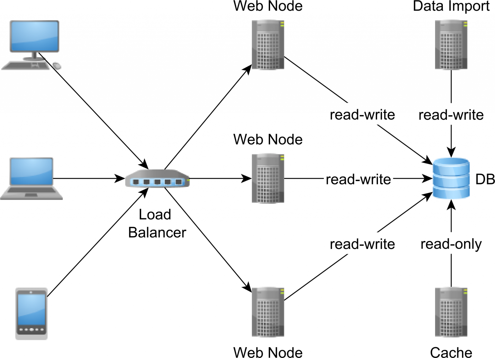

# Issue Summary 🛑

**Duration of the Outage:**  
The outage lasted from 3:45 PM to 6:15 PM UTC on August 14, 2024.

**Impact:**  
Our e-commerce platform, which handles over 20,000 concurrent users during peak hours, decided to take an impromptu siesta, leaving customers unable to shop. 🚫🛒 Imagine a bustling mall suddenly locking its doors—yep, that was us! Approximately 95% of users were affected, resulting in an estimated loss of $150,000 in potential revenue. Social media was abuzz with complaints, and our support team was busier than ever.

**Root Cause:**  
A sneaky misconfiguration in our database replication setup led to data inconsistencies, causing the application to stumble and eventually crash as it tried to read from the corrupted sources. Think of it as trying to read a book with missing pages—frustrating, right?

---

# Timeline ⏰

- **3:45 PM** - 🚨 Alarms! Monitoring systems screamed as error rates skyrocketed across the platform.
- **3:50 PM** - Our brave on-call engineer, alerted by a pager (yes, those still exist), dived into the logs like a detective on a mission.
- **4:00 PM** - Clue #1: Database read requests were failing. Was it the servers? 🤔
- **4:10 PM** - Database team assembled! They began inspecting the primary database and its replicas.
- **4:25 PM** - Red herring! Assumed it was a traffic spike and attempted to scale horizontally. Spoiler: It didn’t work.
- **4:45 PM** - 🕵️ The plot thickens. A misconfiguration during a recent deployment had thrown a replica out of sync, leading to data corruption.
- **5:00 PM** - Senior engineering team enters the scene. Decision: Take the faulty replica offline.
- **5:15 PM** - Backup restored, corrupted data removed. 🛠️
- **6:00 PM** - Service restoration underway. Traffic was carefully monitored to ensure stability.
- **6:15 PM** - 🎉 Full service restored! Crisis averted.

---

# Root Cause and Resolution 🔍

**Root Cause:**  
The outage was caused by a misconfiguration during a routine maintenance operation. Our database replication setup was syncing data with an outdated schema, leading to corrupted data in one of the replicas. When our application tried to read this inconsistent data, it tripped and fell, causing the entire service to go down.

**Resolution:**  
We immediately took the corrupted database replica offline to prevent further damage. The database was then restored from a backup, and the replication setup was reconfigured to ensure all replicas were synced with the correct schema. The application was brought back online gradually to handle the incoming traffic safely.

---

# Corrective and Preventative Measures 🛠️

**Improvements:**

- 🧐 **Validation Process:** Implement a stricter validation process for database schema changes, ensuring all replicas are correctly synced before they go live.
- 🛡️ **Enhanced Monitoring:** Deploy advanced monitoring to detect data inconsistencies in real-time.
- 🔄 **Disaster Recovery Drills:** Schedule regular drills to prepare the team for handling such incidents swiftly and effectively.

**Tasks:**

1. **Reconfigure Database Replication:** Conduct a full audit to ensure consistency across all replicas.
2. **Automated Tests:** Develop and deploy automated tests for data consistency checks before and after schema changes.
3. **Update Incident Response Plan:** Incorporate database integrity verification steps during outages.
4. **Post-Incident Review:** Hold a meeting to discuss the root cause, resolution process, and improvement strategies.

---

# Conclusion 🌟

This outage highlighted the importance of rigorous validation and testing during routine maintenance. By implementing the corrective measures outlined above, we aim to mitigate the risk of similar incidents, ensuring our platform remains reliable and resilient. And hey, next time, let’s try to avoid the siesta, shall we? 😉

